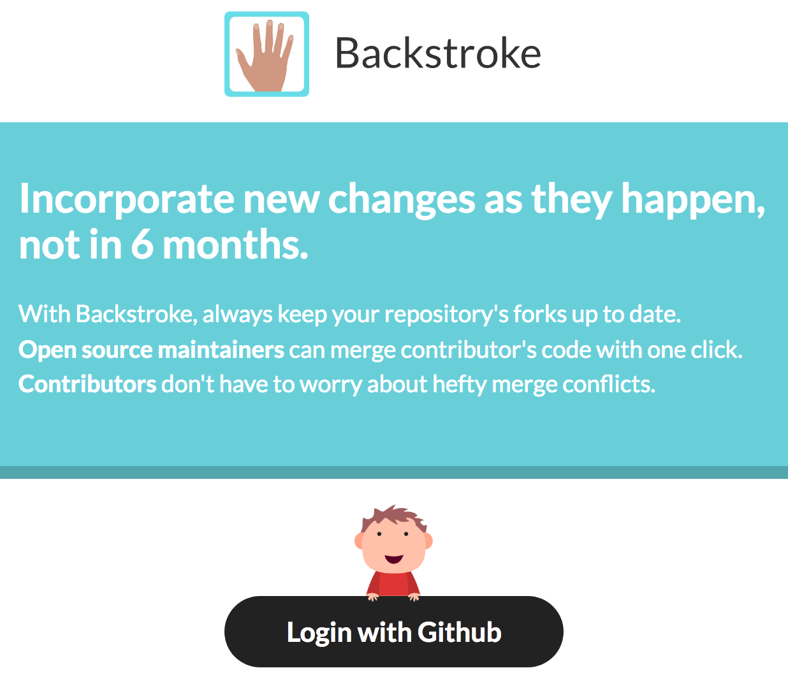

# Backstroke's website

This folder contains all the files to build Backstroke's website.



## React Templating
Backstroke's website is a static site. It's created by rendering a tree of stateless React
components at build time, which is then added to a html file. Since components are stateless, there
are a couple limitations:
- Components must be pure (ie, functions). Components are only rendered once.
- Passing a callback function in a component's props isn't really possible, since components are
  rendered once.

## SCSS Styling
Each component has a respective `styles.scss` that is compiled into css during the build step. On
completion, all stylesheets are concatenated together. A stylesheet for each component scopes styles
to enforce a seperation of concerns.

## Javascript
For ease-of-use, all javascript is required in with script tags and unbundled. While bundling may be
required later, with the quantity of javascript used currently it's a bit heavy handed. A list of
scripts can be found here: https://github.com/backstrokeapp/www/tree/master/assets/scripts

# Development

*NOTE* `tac` is required for the Makefile to work properly.
- OSX: https://unix.stackexchange.com/a/114042/121882
- Ubuntu should have `tac` already.

```sh
$ cd backstroke/site
$ # Install dependencies
$ yarn
$
$ # Run a live-reloading server for development.
$ make watch
$ # Make a build. (Behind the scenes, make watch calls this when a file changes)
$ make build
```

## Making a new component

We have a script that will scaffold out a component for you - run it with `yarn make-component`. The
template used is located in `.component-template`, and the script itself is in `make-component`
(both within the root of the `site` directory). Here's an example invocation of `yarn
make-component`:

```sh
$ yarn make-component
Let's make a new component.
Enter the name of your component, in dash-case: my-component-name
* Copying template to src/components/my-component-name...
You have a new component in src/components/my-component-name:
* src/components/my-component-name/index.js contains your component code.
* src/components/my-component-name/_styles.scss contains your component styles.
* Press enter to open the documentation in your $EDITOR...
```
